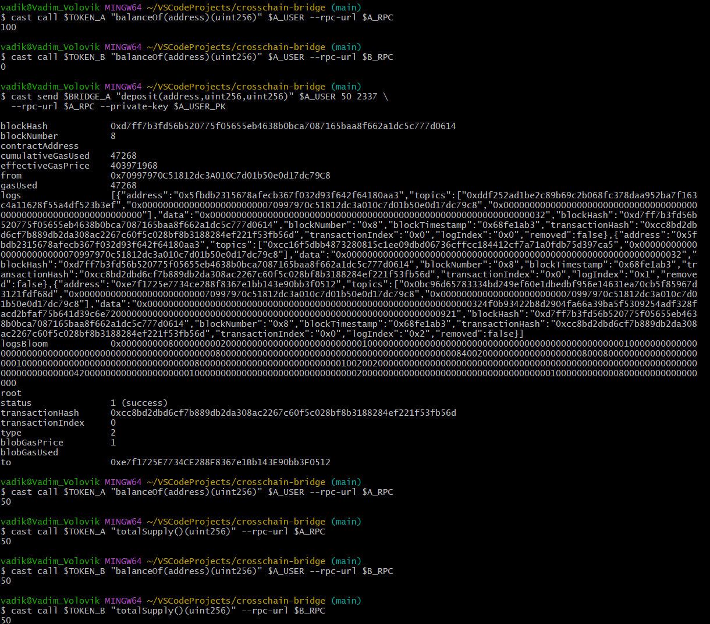

# Crosschain Bridge (ERC-20 Burn → Mint)
Мост переносит токены между двумя EVM-сетями, сохраняя общее предложение

## Архитектура
- В исходной сети (A) контракт `BridgeA` вызывает у `TokenA` сжигание (`burn`) токенов пользователя в `deposit(...)` и эмитит событие `Deposit(from, to, amount, depositId, toChainId)`.
- Рилеер (TS/ethers v6) слушает `Deposit` в сети A, проверяет `toChainId`, ждет N подтверждений и вызывает `BridgeB.redeem(to, amount, depositId)` в целевой сети (B).
- В целевой сети (B) `BridgeB` минтит (`mint`) токены в `TokenB` и помечает `depositId` обработанным (защита от повтора).

### События и защита от повтора
- `Deposit` фиксирует входящий перевод: `from`, `to`, `amount`, `depositId`, `toChainId`.
- `BridgeB` хранит `processedDeposits[depositId] = true` и отклоняет повторные `redeem`.

### Token (ERC20)
- Реализован через `OpenZeppelin` и `AccessControl`
- Поддерживает две роли: `MINTER_ROLE` на выпуск токена и `BURNER_ROLE` на сжигание токена

### Bridge
- Отвечает за перенос токенов - сжигает и выпускает токены в соответствующих сетях, основан на событиях
- Защита от повторного воспроизведения через маппинг processedDeposits
- Поддерживает `RELAYER_ROLE` для обработки событий

### Relayer (ts)
- Отслеживает события в исходное сети
- Логирует ключевые действия

## Юнит-тесты (Solidity / Foundry)
Тесты покрывают:
- Деплой 4 контрактов (2 токена + 2 моста),
- `deposit()` с проверкой события,
- `redeem()` с минтом и защитой от повторной обработки,
- Проверки ролей `MINT_ROLE` / `BURN_ROLE` / `RELAYER_ROLE`.

## Локальный запуск с Anvil (на двух нодах)

### Требования

- Foundry
- Node.js, npm
- Git

### Запуск

1. В первом терминале (сеть A)

```bash
anvil --chain-id 1337 --port 8545
```

2. Во втором терминале (сеть B)

```bash
anvil --chain-id 2337 --port 8546
```

В терминалах напечатаются тестовые адреса и приватные ключи. Понадобятся по два ключа из каждой сети

3. В третьем терминале экспорт переменных окружения:

```bash
export A_RPC=http://127.0.0.1:8545
export B_RPC=http://127.0.0.1:8546

export A_DEPLOYER_PK=0xa... # Первый ключ из сети A
export A_USER_PK=0xb... # Второй ключ из сети A
export B_DEPLOYER_PK=0xc... # Первый ключ из сети B
export B_RELAYER_PK=0xd... # Второй ключ из сети B

export A_DEPLOYER=$(cast wallet address --private-key $A_DEPLOYER_PK)
export A_USER=$(cast wallet address --private-key $A_USER_PK)
export B_DEPLOYER=$(cast wallet address --private-key $B_DEPLOYER_PK)
export B_RELAYER=$(cast wallet address --private-key $B_RELAYER_PK)

echo A_DEPLOYER=$A_DEPLOYER
echo A_USER=$A_USER
echo B_DEPLOYER=$B_DEPLOYER
echo B_RELAYER=$B_RELAYER
```

4. Компиляция контрактов:

```bash
forge build
```

5. Деплой четырех контрактов:

```bash
export TOKEN_A=$(forge create --rpc-url $A_RPC --private-key $A_DEPLOYER_PK --broadcast \
  src/Erc20Token.sol:Erc20Token --constructor-args "ERC20 Token A" "ERCTA" \
  | grep "Deployed to:" | awk '{print $3}')
echo TOKEN_A=$TOKEN_A

export BRIDGE_A=$(forge create --rpc-url $A_RPC --private-key $A_DEPLOYER_PK --broadcast \
  src/Bridge.sol:Bridge --constructor-args $TOKEN_A \
  | grep "Deployed to:" | awk '{print $3}')
echo BRIDGE_A=$BRIDGE_A

export TOKEN_B=$(forge create --rpc-url $B_RPC --private-key $B_DEPLOYER_PK --broadcast \
  src/Erc20Token.sol:Erc20Token --constructor-args "ERC20 Token B" "ERCTB" \
  | grep "Deployed to:" | awk '{print $3}')
echo TOKEN_B=$TOKEN_B

export BRIDGE_B=$(forge create --rpc-url $B_RPC --private-key $B_DEPLOYER_PK --broadcast \
  src/Bridge.sol:Bridge --constructor-args $TOKEN_B \
  | grep "Deployed to:" | awk '{print $3}')
echo BRIDGE_B=$BRIDGE_B
```

6. Выдача ролей и балансов:

```bash
cast send $TOKEN_A "grantRole(bytes32,address)" \
  $(cast call $TOKEN_A "BURN_ROLE()(bytes32)" --rpc-url $A_RPC) \
  $BRIDGE_A --rpc-url $A_RPC --private-key $A_DEPLOYER_PK

cast send $TOKEN_A "grantRole(bytes32,address)" \
  $(cast call $TOKEN_A "MINT_ROLE()(bytes32)" --rpc-url $A_RPC) \
  $A_DEPLOYER --rpc-url $A_RPC --private-key $A_DEPLOYER_PK

cast send $TOKEN_A "mint(address,uint256)" $A_USER 100 \
  --rpc-url $A_RPC --private-key $A_DEPLOYER_PK

cast call $TOKEN_A "balanceOf(address)(uint256)" $A_USER --rpc-url $A_RPC

cast send $TOKEN_B "grantRole(bytes32,address)" \
  $(cast call $TOKEN_B "MINT_ROLE()(bytes32)" --rpc-url $B_RPC) \
  $BRIDGE_B --rpc-url $B_RPC --private-key $B_DEPLOYER_PK

cast send $BRIDGE_B "grantRole(bytes32,address)" \
  $(cast call $BRIDGE_B "RELAYER_ROLE()(bytes32)" --rpc-url $B_RPC) \
  $B_RELAYER --rpc-url $B_RPC --private-key $B_DEPLOYER_PK
```

7. Настройка .env.local:

```
SRC_RPC_URL=http://127.0.0.1:8545
SRC_BRIDGE_ADDRESS= # Сюда подставить $BRIDGE_A

DST_RPC_URL=http://127.0.0.1:8546
DST_BRIDGE_ADDRESS= # Сюда подставить $BRIDGE_B

RELAYER_PRIVATE_KEY= # Сюда подставить $B_RELAYER_PK

REQUIRED_CONFIRMATIONS=1
MAX_RETRIES=5
```

8. Запуск Relayer:

```bash
cd relayer
npm run relayer:local
```

9. Проверка балансов, осуществление депозита и повторная проверка балансов:

```bash
cast call $TOKEN_A "balanceOf(address)(uint256)" $A_USER --rpc-url $A_RPC

cast call $TOKEN_B "balanceOf(address)(uint256)" $A_USER --rpc-url $B_RPC

cast send $BRIDGE_A "deposit(address,uint256,uint256)" $A_USER 50 2337 \
  --rpc-url $A_RPC --private-key $A_USER_PK

cast call $TOKEN_A "balanceOf(address)(uint256)" $A_USER --rpc-url $A_RPC

cast call $TOKEN_A "totalSupply()(uint256)" --rpc-url $A_RPC

cast call $TOKEN_B "balanceOf(address)(uint256)" $A_USER --rpc-url $B_RPC

cast call $TOKEN_B "totalSupply()(uint256)" --rpc-url $B_RPC
```

10. Результат

Перевод зафиксировался, токены из сети A сгорели, токены в сети B выпустились

